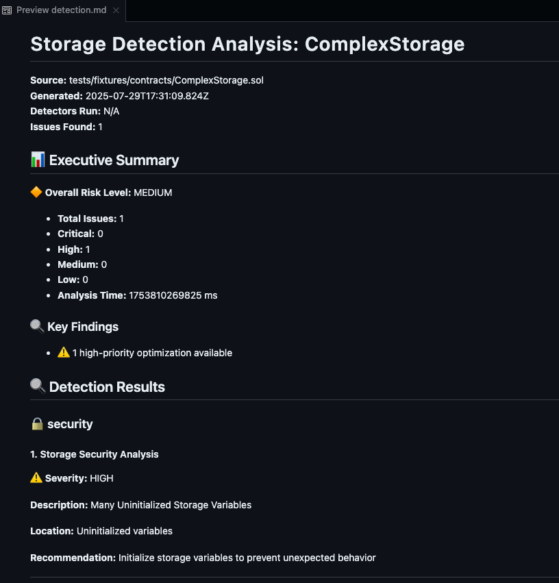
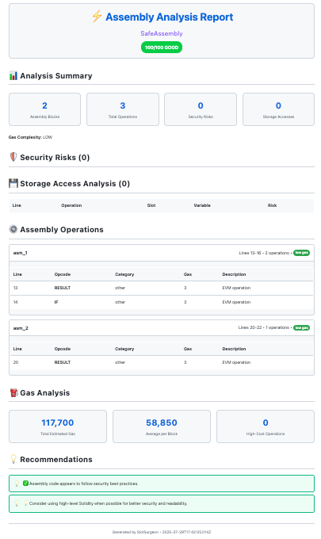

# SlotSurgeon 

**Professional Ethereum Storage Slot Analysis & Optimization Tool**

[📖 Documentation](#documentation) • [🚀 Quick Start](#installation) • [💡 Examples](#usage-examples) • [🏗️ **Architecture**](#-architecture) •  [🤝 **Contributing**](#-contributing)

---

## 🎯 **Features**

### **🔍 Storage Analysis**
- **Visual Storage Layout**: ASCII grid visualization of contract storage slots
- **Variable Packing Analysis**: Identify gas optimization opportunities
- **Collision Detection**: Detect storage layout conflicts in upgrades
- **Cross-Contract Analysis**: Compare storage layouts across multiple contracts

### **⚡ Assembly Analysis** 
- **Gas Hotspot Detection**: Identify expensive operations and optimization opportunities
- **Security Risk Assessment**: Detect dangerous opcodes and patterns
- **Optimization Suggestions**: Actionable recommendations to reduce gas costs
- **Interactive HTML Reports**: Professional assembly analysis reports

### **🔄 Upgrade Safety**
- **Upgrade Compatibility**: Analyze storage layout changes between contract versions
- **Migration Analysis**: Detailed impact assessment of contract upgrades
- **Safety Scoring**: Risk assessment with compatibility scores
- **Migration Tips**: Specific recommendations for safe upgrades

### **📊 Multiple Output Formats**
- **Terminal**: Rich terminal output with colors and formatting
- **HTML**: Interactive reports with professional styling
- **Markdown**: Documentation-friendly format
- **JSON**: Machine-readable data for integration

### **🛡️ Security & Optimization**
- **Storage Packing Optimization**: Reduce gas costs through better variable ordering
- **Security Pattern Detection**: Identify common smart contract vulnerabilities
- **Gas Impact Analysis**: Quantify potential savings from optimizations
- **Best Practice Recommendations**: Industry-standard security guidelines

---

## 🛠️ **Tech Stack**

### **Core Technologies**
- **TypeScript 5.0+**: Type-safe development with modern features
- **Commander.js**: Professional CLI interface and command handling
- **Solidity Parser**: Custom AST parsing for smart contract analysis
- **Jest**: Comprehensive testing framework with 55+ test cases
### **Architecture Components**
- **Parser Engine**: Solidity contract AST parsing and analysis
- **Storage Calculator**: Advanced slot mapping and collision detection
- **Assembly Analyzer**: Bytecode analysis and gas optimization
- **Visualization Engine**: Multi-format report generation
- **Detection Framework**: Pluggable security and optimization detectors

---

## 🚀 **Installation**

### **Global Installation (Recommended)**
~~~
npm install -g slot-surgeon
~~~

### **Local Installation**
~~~
npm install slot-surgeon
npx slot-surgeon --help
~~~

### **From Source**
~~~
git clone https://github.com/techyarnav/SlotSurgeon.git
cd SlotSurgeon
npm install
npm run build
npm link
~~~
- Run Tests
~~~
npm test
~~~
- Output

~~~
SlotSurgeon % npm test

> slot-surgeon@0.1.0 test
> jest

 PASS  tests/unit/collision-detector.test.ts
 PASS  tests/unit/output-formatter.test.ts
 PASS  tests/unit/slot-calculator.test.ts
 PASS  tests/unit/solidity-parser.test.ts
 PASS  tests/integration/visualizers.test.ts
 PASS  tests/integration/full-analysis.test.ts
 PASS  tests/e2e/terminal-output.test.ts
 PASS  tests/e2e/cli-commands.test.ts

Test Suites: 8 passed, 8 total
Tests:       55 passed, 55 total
Snapshots:   0 total
Time:        4.649 s
Ran all test suites.
SlotSurgeon % 
~~~
### **System Requirements**
- Node.js 16.0.0 or higher
- npm 7.0.0 or higher
- 50MB disk space

---
## 📖 **Usage Examples**

### **Quick Start**

- Analyze storage layout
~~~
slot-surgeon visualize contracts/MyContract.sol
~~~

- Detect optimization opportunities
~~~
slot-surgeon detect contracts/MyContract.sol --gas-estimates
~~~

- Check upgrade safety
~~~
slot-surgeon diff contracts/V1.sol contracts/V2.sol
~~~

### **Command Overview**

~~~
slot-surgeon --help
~~~
- Output
~~~
SlotSurgeon % slot-surgeon --help

Usage: slot-surgeon [options] [command]

CLI tooling for Ethereum storage slot mapping and analysis

Options:
  -V, --version                         output the version number
  -h, --help                            display help for command

Commands:
  analyze [options] <file>              Analyze Solidity contract storage slots and detect collisions
  map [options] <file>                  Generate storage slot mapping from Solidity file
  check [options] <old> <new>           Detect storage-layout collisions between two contract versions
  visualize [options] <solidityFile>    Render an ASCII grid of a contract storage layout
  html [options] <solidityFile>         Generate HTML or Markdown visualization of contract storage layout
  diff [options] <v1-file> <v2-file>    Analyze upgrade safety between two contract versions
  assembly [options] <solidityFile>     Analyze assembly bytecode and gas optimization opportunities
  cross-contract [options] <directory>  Analyze storage layouts across multiple contracts
  detect [options] <solidityFile>       Run storage-related security and optimization detectors
  help [command]                        display help for command
SlotSurgeon % 
~~~

---

## 🎯 **Command Reference**

### **1️⃣ Storage Visualization**

~~~
slot-surgeon visualize tests/fixtures/contracts/SimpleStorage.sol

slot-surgeon visualize tests/fixtures/contracts/ComplexStorage.sol --format terminal

slot-surgeon visualize tests/fixtures/contracts/BaseContract.sol --format ascii
~~~

**Output:**

### **2️⃣ Storage Detection & Analysis**

~~~
slot-surgeon detect tests/fixtures/contracts/ComplexStorage.sol
~~~

**Output:**

~~~
slot-surgeon detect tests/fixtures/contracts/ComplexStorage.sol --list-detectors 
~~~

#### **JSON Output**
~~~
slot-surgeon detect tests/fixtures/contracts/ComplexStorage.sol --format json --output detection.json
~~~

**Output:**

#### **Markdown Output**
~~~
slot-surgeon detect tests/fixtures/contracts/ComplexStorage.sol --format markdown --output detection.md
~~~
**Output:**

### **3️⃣ Assembly Analysis**
~~~
slot-surgeon assembly tests/fixtures/contracts/SafeAssembly.sol
~~~

**Output:**

#### **HTML Output**
~~~
slot-surgeon assembly tests/fixtures/contracts/SafeAssembly.sol --format html --output assembly.html
~~~

---

### **4️⃣ Upgrade Safety Analysis**

~~~
slot-surgeon diff tests/fixtures/contracts/UpgradeV1.sol tests/fixtures/contracts/UpgradeV2_Safe.sol  

slot-surgeon diff tests/fixtures/contracts/UpgradeV1.sol tests/fixtures/contracts/UpgradeV2_Unsafe.sol  
~~~

**Output:**

#### **JSON Output**
~~~
slot-surgeon diff tests/fixtures/contracts/UpgradeV1.sol tests/fixtures/contracts/UpgradeV2_Safe.sol --format json --output diff.json

slot-surgeon diff tests/fixtures/contracts/UpgradeV1.sol tests/fixtures/contracts/UpgradeV2_Unsafe.sol --format json --output diff.json
~~~

**Output:**

  
JSON Output Generated

  {
  "contractName": "TokenContract",
  "v1Summary": {
    "totalSlots": 5,
    "variables": 5,
    "packedSlots": 0
  },
  "v2Summary": {
    "totalSlots": 5,
    "variables": 6,
    "packedSlots": 1
  },
  "changes": [
    {
      "type": "moved",
      "variable": {
        "name": "owner",
        "type": "address",
        "slot": 1,
        "offset": 0,
        "size": 20,
        "isStateVariable": true,
        "packed": true
      },
      "oldVariable": {
        "name": "owner",
        "type": "address",
        "slot": 0,
        "offset": 0,
        "size": 20,
        "isStateVariable": true,
        "packed": true
      },
      "severity": "critical",
      "description": "Variable \"owner\" moved from slot 0 to slot 1",
      "recommendation": "Moving variables breaks storage layout. Add new variables at the end instead."
    },
    {
      "type": "moved",
      "variable": {
        "name": "totalSupply",
        "type": "uint256",
        "slot": 0,
        "offset": 0,
        "size": 32,
        "isStateVariable": true,
        "packed": false
      },
      "oldVariable": {
        "name": "totalSupply",
        "type": "uint256",
        "slot": 1,
        "offset": 0,
        "size": 32,
        "isStateVariable": true,
        "packed": false
      },
      "severity": "critical",
      "description": "Variable \"totalSupply\" moved from slot 1 to slot 0",
      "recommendation": "Moving variables breaks storage layout. Add new variables at the end instead."
    },
    {
      "type": "moved",
      "variable": {
        "name": "paused",
        "type": "bool",
        "slot": 1,
        "offset": 20,
        "size": 1,
        "isStateVariable": true,
        "packed": true
      },
      "oldVariable": {
        "name": "paused",
        "type": "bool",
        "slot": 2,
        "offset": 0,
        "size": 1,
        "isStateVariable": true,
        "packed": true
      },
      "severity": "critical",
      "description": "Variable \"paused\" moved from slot 2 to slot 1",
      "recommendation": "Moving variables breaks storage layout. Add new variables at the end instead."
    },
    {
      "type": "moved",
      "variable": {
        "name": "name",
        "type": "string",
        "slot": 2,
        "offset": 0,
        "size": 32,
        "isStateVariable": true,
        "packed": false
      },
      "oldVariable": {
        "name": "name",
        "type": "string",
        "slot": 3,
        "offset": 0,
        "size": 32,
        "isStateVariable": true,
        "packed": false
      },
      "severity": "critical",
      "description": "Variable \"name\" moved from slot 3 to slot 2",
      "recommendation": "Moving variables breaks storage layout. Add new variables at the end instead."
    },
    {
      "type": "moved",
      "variable": {
        "name": "symbol",
        "type": "string",
        "slot": 3,
        "offset": 0,
        "size": 32,
        "isStateVariable": true,
        "packed": false
      },
      "oldVariable": {
        "name": "symbol",
        "type": "string",
        "slot": 4,
        "offset": 0,
        "size": 32,
        "isStateVariable": true,
        "packed": false
      },
      "severity": "critical",
      "description": "Variable \"symbol\" moved from slot 4 to slot 3",
      "recommendation": "Moving variables breaks storage layout. Add new variables at the end instead."
    },
    {
      "type": "added",
      "variable": {
        "name": "newFeature",
        "type": "uint256",
        "slot": 4,
        "offset": 0,
        "size": 32,
        "isStateVariable": true,
        "packed": false
      },
      "severity": "safe",
      "description": "New variable \"newFeature\" added at slot 4",
      "recommendation": "Adding variables at the end is safe for upgrades."
    }
  ],
  "compatibility": {
    "score": 0,
    "level": "critical",
    "description": "Critical storage layout conflicts detected. Upgrade will likely fail or corrupt data."
  },
  "recommendations": [
    "🚨 CRITICAL: Do not deploy this upgrade. 5 critical issues found.",
    "• Consider creating a new contract with proper storage layout instead of upgrading."
  ],
  "collisionReport": {
    "contract": "TokenContract",
    "collisions": [],
    "moved": [
      {
        "name": "owner",
        "type": "address",
        "slot": 1,
        "offset": 0,
        "size": 20,
        "isStateVariable": true,
        "packed": true
      },
      {
        "name": "totalSupply",
        "type": "uint256",
        "slot": 0,
        "offset": 0,
        "size": 32,
        "isStateVariable": true,
        "packed": false
      },
      {
        "name": "paused",
        "type": "bool",
        "slot": 1,
        "offset": 20,
        "size": 1,
        "isStateVariable": true,
        "packed": true
      },
      {
        "name": "name",
        "type": "string",
        "slot": 2,
        "offset": 0,
        "size": 32,
        "isStateVariable": true,
        "packed": false
      },
      {
        "name": "symbol",
        "type": "string",
        "slot": 3,
        "offset": 0,
        "size": 32,
        "isStateVariable": true,
        "packed": false
      }
    ],
    "added": [
      {
        "name": "newFeature",
        "type": "uint256",
        "slot": 4,
        "offset": 0,
        "size": 32,
        "isStateVariable": true,
        "packed": false
      }
    ],
    "removed": [],
    "safe": false
  },
  "storageGrowth": {
    "slotsAdded": 0,
    "bytesWasted": -32,
    "efficiencyChange": 20
  },
  "metadata": {
    "generatedAt": "2025-07-29T17:51:45.595Z",
    "tool": "SlotSurgeon",
    "version": "0.1.0"
  }
}

#### **Markdown Output**

~~~
slot-surgeon diff tests/fixtures/contracts/UpgradeV1.sol tests/fixtures/contracts/UpgradeV2_Unsafe.sol --format markdown --output diff.md
~~~

#### **HTML Output**

~~~
slot-surgeon diff tests/fixtures/contracts/UpgradeV1.sol tests/fixtures/contracts/UpgradeV2_Unsafe.sol --format html --output diff.html
~~~

---

### **5️⃣ Cross-Contract Analysis**

#### **Terminal Output**
~~~
slot-surgeon cross-contract tests/fixtures/contracts/
~~~

**Output:**

~~~
slot-surgeon check tests/fixtures/contracts/UpgradeV1.sol tests/fixtures/contracts/UpgradeV2_Safe.sol

slot-surgeon check tests/fixtures/contracts/UpgradeV1.sol tests/fixtures/contracts/UpgradeV2_Unsafe.sol
~~~

#### **JSON Output**
~~~
slot-surgeon cross-contract tests/fixtures/contracts/ --format json --output cross-contract.json
~~~

**Output:**

  
View the JSON Output Generated

  {
  "contracts": [
    {
      "name": "BaseContract",
      "baseContracts": [],
      "stateVariables": [
        {
          "name": "owner",
          "typeName": "address",
          "visibility": "public",
          "isConstant": false,
          "isImmutable": false
        },
        {
          "name": "baseValue",
          "typeName": "uint256",
          "visibility": "public",
          "isConstant": false,
          "isImmutable": false
        },
        {
          "name": "initialized",
          "typeName": "bool",
          "visibility": "public",
          "isConstant": false,
          "isImmutable": false
        }
      ],
      "functions": [],
      "events": [],
      "modifiers": [],
      "isAbstract": false,
      "isInterface": false,
      "isLibrary": false,
      "filePath": "tests/fixtures/contracts/BaseContract.sol",
      "source": "// SPDX-License-Identifier: MIT\npragma solidity ^0.8.0;\n\ncontract BaseContract {\n    address public owner;\n    uint256 public baseValue;\n    bool public initialized;\n\n    constructor() {\n        owner = msg.sender;\n        initialized = true;\n    }\n}\n\ncontract ChildContract is BaseContract {\n    uint256 public childValue;\n    string public childName;\n    mapping(address => uint256) public childBalances;\n\n    constructor(string memory _name) {\n        childName = _name;\n    }\n}\n\ncontract GrandChildContract is ChildContract {\n    bytes32 public grandChildData;\n    uint128 public packed1;\n    uint128 public packed2;\n\n    constructor() ChildContract(\"GrandChild\") {\n        grandChildData = keccak256(\"data\");\n    }\n}\n",
      "contractType": "contract",
      "dependencies": [],
      "storageMapping": {
        "contractName": "BaseContract",
        "variables": [
          {
            "name": "owner",
            "type": "address",
            "slot": 0,
            "offset": 0,
            "size": 20,
            "isStateVariable": true,
            "packed": true
          },
          {
            "name": "baseValue",
            "type": "uint256",
            "slot": 1,
            "offset": 0,
            "size": 32,
            "isStateVariable": true,
            "packed": false
          },
          {
            "name": "initialized",
            "type": "bool",
            "slot": 2,
            "offset": 0,
            "size": 1,
            "isStateVariable": true,
            "packed": true
          }
        ],
        "totalSlots": 3,
        "packedSlots": []
      },
      "complexity": 3,
      "size": 722,
      "riskLevel": "low"
    },
    {
      "name": "ChildContract",
      "baseContracts": [
        "BaseContract"
      ],
      "stateVariables": [
        {
          "name": "childValue",
          "typeName": "uint256",
          "visibility": "public",
          "isConstant": false,
          "isImmutable": false
        },
        {
          "name": "childName",
          "typeName": "string",
          "visibility": "public",
          "isConstant": false,
          "isImmutable": false
        }
      ],
      "functions": [],
      "events": [],
      "modifiers": [],
      "isAbstract": false,
      "isInterface": false,
      "isLibrary": false,
      "filePath": "tests/fixtures/contracts/BaseContract.sol",
      "source": "// SPDX-License-Identifier: MIT\npragma solidity ^0.8.0;\n\ncontract BaseContract {\n    address public owner;\n    uint256 public baseValue;\n    bool public initialized;\n\n    constructor() {\n        owner = msg.sender;\n        initialized = true;\n    }\n}\n\ncontract ChildContract is BaseContract {\n    uint256 public childValue;\n    string public childName;\n    mapping(address => uint256) public childBalances;\n\n    constructor(string memory _name) {\n        childName = _name;\n    }\n}\n\ncontract GrandChildContract is ChildContract {\n    bytes32 public grandChildData;\n    uint128 public packed1;\n    uint128 public packed2;\n\n    constructor() ChildContract(\"GrandChild\") {\n        grandChildData = keccak256(\"data\");\n    }\n}\n",
      "contractType": "contract",
      "dependencies": [],
      "storageMapping": {
        "contractName": "ChildContract",
        "variables": [
          {
            "name": "childValue",
            "type": "uint256",
            "slot": 0,
            "offset": 0,
            "size": 32,
            "isStateVariable": true,
            "packed": false
          },
          {
            "name": "childName",
            "type": "string",
            "slot": 1,
            "offset": 0,
            "size": 32,
            "isStateVariable": true,
            "packed": false
          }
        ],
        "totalSlots": 2,
        "packedSlots": []
      },
      "complexity": 2,
      "size": 722,
      "riskLevel": "low"
    },
    {
      "name": "GrandChildContract",
      "baseContracts": [
        "ChildContract"
      ],
      "stateVariables": [
        {
          "name": "grandChildData",
          "typeName": "bytes32",
          "visibility": "public",
          "isConstant": false,
          "isImmutable": false
        }
      ],
      "functions": [],
      "events": [],
      "modifiers": [],
      "isAbstract": false,
      "isInterface": false,
      "isLibrary": false,
      "filePath": "tests/fixtures/contracts/BaseContract.sol",
      "source": "// SPDX-License-Identifier: MIT\npragma solidity ^0.8.0;\n\ncontract BaseContract {\n    address public owner;\n    uint256 public baseValue;\n    bool public initialized;\n\n    constructor() {\n        owner = msg.sender;\n        initialized = true;\n    }\n}\n\ncontract ChildContract is BaseContract {\n    uint256 public childValue;\n    string public childName;\n    mapping(address => uint256) public childBalances;\n\n    constructor(string memory _name) {\n        childName = _name;\n    }\n}\n\ncontract GrandChildContract is ChildContract {\n    bytes32 public grandChildData;\n    uint128 public packed1;\n    uint128 public packed2;\n\n    constructor() ChildContract(\"GrandChild\") {\n        grandChildData = keccak256(\"data\");\n    }\n}\n",
      "contractType": "contract",
      "dependencies": [],
      "storageMapping": {
        "contractName": "GrandChildContract",
        "variables": [
          {
            "name": "grandChildData",
            "type": "bytes32",
            "slot": 0,
            "offset": 0,
            "size": 32,
            "isStateVariable": true,
            "packed": false
          }
        ],
        "totalSlots": 1,
        "packedSlots": []
      },
      "complexity": 1,
      "size": 722,
      "riskLevel": "low"
    },
    {
      "name": "ComplexStorage",
      "baseContracts": [],
      "stateVariables": [
        {
          "name": "owner",
          "typeName": "address",
          "visibility": "public",
          "isConstant": false,
          "isImmutable": false
        },
        {
          "name": "isActive",
          "typeName": "bool",
          "visibility": "public",
          "isConstant": false,
          "isImmutable": false
        },
        {
          "name": "description",
          "typeName": "string",
          "visibility": "public",
          "isConstant": false,
          "isImmutable": false
        }
      ],
      "functions": [],
      "events": [],
      "modifiers": [],
      "isAbstract": false,
      "isInterface": false,
      "isLibrary": false,
      "filePath": "tests/fixtures/contracts/ComplexStorage.sol",
      "source": "// SPDX-License-Identifier: MIT\npragma solidity ^0.8.0;\n\ncontract ComplexStorage {\n\n    uint128 public firstHalf;\n    uint128 public secondHalf;\n    address public owner;\n    uint96 public balance;\n    bool public isActive;\n    uint8 public status;\n    uint16 public version;\n    uint32 public timestamp;\n    uint32 public counter;\n    string public description;\n    bytes public metadata;\n    uint256[] public numbers;\n    mapping(address => uint256) public balances;\n\n    struct UserInfo {\n        uint256 balance;\n        bool active;\n        uint32 lastAction;\n    }\n\n    mapping(address => UserInfo) public users;\n\n\n    constructor() {\n        owner = msg.sender;\n        isActive = true;\n        version = 1;\n        timestamp = uint32(block.timestamp);\n    }\n}\n",
      "contractType": "contract",
      "dependencies": [],
      "storageMapping": {
        "contractName": "ComplexStorage",
        "variables": [
          {
            "name": "owner",
            "type": "address",
            "slot": 0,
            "offset": 0,
            "size": 20,
            "isStateVariable": true,
            "packed": true
          },
          {
            "name": "isActive",
            "type": "bool",
            "slot": 0,
            "offset": 20,
            "size": 1,
            "isStateVariable": true,
            "packed": true
          },
          {
            "name": "description",
            "type": "string",
            "slot": 1,
            "offset": 0,
            "size": 32,
            "isStateVariable": true,
            "packed": false
          }
        ],
        "totalSlots": 2,
        "packedSlots": [
          0
        ]
      },
      "complexity": 3,
      "size": 768,
      "riskLevel": "low"
    },
    {
      "name": "SafeAssembly",
      "baseContracts": [],
      "stateVariables": [
        {
          "name": "data",
          "typeName": "uint256",
          "visibility": "public",
          "isConstant": false,
          "isImmutable": false
        },
        {
          "name": "owner",
          "typeName": "address",
          "visibility": "public",
          "isConstant": false,
          "isImmutable": false
        }
      ],
      "functions": [],
      "events": [],
      "modifiers": [],
      "isAbstract": false,
      "isInterface": false,
      "isLibrary": false,
      "filePath": "tests/fixtures/contracts/SafeAssembly.sol",
      "source": "// SPDX-License-Identifier: MIT\npragma solidity ^0.8.0;\n\ncontract SafeAssembly {\n    uint256 public data;\n    address public owner;\n\n    constructor() {\n        owner = msg.sender;\n    }\n\n    function safeAdd(uint256 a, uint256 b) public pure returns (uint256 result) {\n        assembly {\n            result := add(a, b)\n            if lt(result, a) { revert(0, 0) }\n        }\n    }\n\n    function getOwner() public view returns (address result) {\n        assembly {\n            result := sload(owner.slot)\n        }\n    }\n}\n",
      "contractType": "contract",
      "dependencies": [],
      "storageMapping": {
        "contractName": "SafeAssembly",
        "variables": [
          {
            "name": "data",
            "type": "uint256",
            "slot": 0,
            "offset": 0,
            "size": 32,
            "isStateVariable": true,
            "packed": false
          },
          {
            "name": "owner",
            "type": "address",
            "slot": 1,
            "offset": 0,
            "size": 20,
            "isStateVariable": true,
            "packed": true
          }
        ],
        "totalSlots": 2,
        "packedSlots": []
      },
      "complexity": 2,
      "size": 524,
      "riskLevel": "low"
    },
    {
      "name": "SimpleStorage",
      "baseContracts": [],
      "stateVariables": [
        {
          "name": "value",
          "typeName": "uint256",
          "visibility": "public",
          "isConstant": false,
          "isImmutable": false
        },
        {
          "name": "owner",
          "typeName": "address",
          "visibility": "public",
          "isConstant": false,
          "isImmutable": false
        },
        {
          "name": "isActive",
          "typeName": "bool",
          "visibility": "public",
          "isConstant": false,
          "isImmutable": false
        },
        {
          "name": "name",
          "typeName": "string",
          "visibility": "public",
          "isConstant": false,
          "isImmutable": false
        },
        {
          "name": "data",
          "typeName": "bytes32",
          "visibility": "public",
          "isConstant": false,
          "isImmutable": false
        }
      ],
      "functions": [],
      "events": [],
      "modifiers": [],
      "isAbstract": false,
      "isInterface": false,
      "isLibrary": false,
      "filePath": "tests/fixtures/contracts/SimpleStorage.sol",
      "source": "// SPDX-License-Identifier: MIT\npragma solidity ^0.8.0;\n\ncontract SimpleStorage {\n    uint256 public value;\n    address public owner;\n    bool public isActive;\n    uint8 public smallNumber;\n    uint16 public mediumNumber;\n    string public name;\n    bytes32 public data;\n\n    constructor() {\n        owner = msg.sender;\n        isActive = true;\n        name = \"SimpleStorage\";\n    }\n\n    function setValue(uint256 _value) public {\n        require(msg.sender == owner, \"Not owner\");\n        value = _value;\n    }\n}\n",
      "contractType": "contract",
      "dependencies": [],
      "storageMapping": {
        "contractName": "SimpleStorage",
        "variables": [
          {
            "name": "value",
            "type": "uint256",
            "slot": 0,
            "offset": 0,
            "size": 32,
            "isStateVariable": true,
            "packed": false
          },
          {
            "name": "owner",
            "type": "address",
            "slot": 1,
            "offset": 0,
            "size": 20,
            "isStateVariable": true,
            "packed": true
          },
          {
            "name": "isActive",
            "type": "bool",
            "slot": 1,
            "offset": 20,
            "size": 1,
            "isStateVariable": true,
            "packed": true
          },
          {
            "name": "name",
            "type": "string",
            "slot": 2,
            "offset": 0,
            "size": 32,
            "isStateVariable": true,
            "packed": false
          },
          {
            "name": "data",
            "type": "bytes32",
            "slot": 3,
            "offset": 0,
            "size": 32,
            "isStateVariable": true,
            "packed": false
          }
        ],
        "totalSlots": 4,
        "packedSlots": [
          1
        ]
      },
      "complexity": 5,
      "size": 514,
      "riskLevel": "low"
    },
    {
      "name": "TokenContract",
      "baseContracts": [],
      "stateVariables": [
        {
          "name": "owner",
          "typeName": "address",
          "visibility": "public",
          "isConstant": false,
          "isImmutable": false
        },
        {
          "name": "totalSupply",
          "typeName": "uint256",
          "visibility": "public",
          "isConstant": false,
          "isImmutable": false
        },
        {
          "name": "paused",
          "typeName": "bool",
          "visibility": "public",
          "isConstant": false,
          "isImmutable": false
        },
        {
          "name": "name",
          "typeName": "string",
          "visibility": "public",
          "isConstant": false,
          "isImmutable": false
        },
        {
          "name": "symbol",
          "typeName": "string",
          "visibility": "public",
          "isConstant": false,
          "isImmutable": false
        }
      ],
      "functions": [],
      "events": [],
      "modifiers": [],
      "isAbstract": false,
      "isInterface": false,
      "isLibrary": false,
      "filePath": "tests/fixtures/contracts/UpgradeV1.sol",
      "source": "// SPDX-License-Identifier: MIT\npragma solidity ^0.8.0;\n\ncontract TokenContract {\n    address public owner;\n    uint256 public totalSupply;\n    uint8 public decimals;\n    bool public paused;\n    mapping(address => uint256) public balances;\n    mapping(address => bool) public blacklisted;\n    string public name;\n    string public symbol;\n\n    constructor() {\n        owner = msg.sender;\n        decimals = 18;\n        name = \"Token\";\n        symbol = \"TKN\";\n    }\n}\n",
      "contractType": "contract",
      "dependencies": [],
      "storageMapping": {
        "contractName": "TokenContract",
        "variables": [
          {
            "name": "owner",
            "type": "address",
            "slot": 0,
            "offset": 0,
            "size": 20,
            "isStateVariable": true,
            "packed": true
          },
          {
            "name": "totalSupply",
            "type": "uint256",
            "slot": 1,
            "offset": 0,
            "size": 32,
            "isStateVariable": true,
            "packed": false
          },
          {
            "name": "paused",
            "type": "bool",
            "slot": 2,
            "offset": 0,
            "size": 1,
            "isStateVariable": true,
            "packed": true
          },
          {
            "name": "name",
            "type": "string",
            "slot": 3,
            "offset": 0,
            "size": 32,
            "isStateVariable": true,
            "packed": false
          },
          {
            "name": "symbol",
            "type": "string",
            "slot": 4,
            "offset": 0,
            "size": 32,
            "isStateVariable": true,
            "packed": false
          }
        ],
        "totalSlots": 5,
        "packedSlots": []
      },
      "complexity": 5,
      "size": 467,
      "riskLevel": "low"
    },
    {
      "name": "TokenContract",
      "baseContracts": [],
      "stateVariables": [
        {
          "name": "owner",
          "typeName": "address",
          "visibility": "public",
          "isConstant": false,
          "isImmutable": false
        },
        {
          "name": "totalSupply",
          "typeName": "uint256",
          "visibility": "public",
          "isConstant": false,
          "isImmutable": false
        },
        {
          "name": "paused",
          "typeName": "bool",
          "visibility": "public",
          "isConstant": false,
          "isImmutable": false
        },
        {
          "name": "name",
          "typeName": "string",
          "visibility": "public",
          "isConstant": false,
          "isImmutable": false
        },
        {
          "name": "symbol",
          "typeName": "string",
          "visibility": "public",
          "isConstant": false,
          "isImmutable": false
        },
        {
          "name": "maxSupply",
          "typeName": "uint256",
          "visibility": "public",
          "isConstant": false,
          "isImmutable": false
        },
        {
          "name": "minter",
          "typeName": "address",
          "visibility": "public",
          "isConstant": false,
          "isImmutable": false
        },
        {
          "name": "mintingFee",
          "typeName": "uint256",
          "visibility": "public",
          "isConstant": false,
          "isImmutable": false
        }
      ],
      "functions": [],
      "events": [],
      "modifiers": [],
      "isAbstract": false,
      "isInterface": false,
      "isLibrary": false,
      "filePath": "tests/fixtures/contracts/UpgradeV2_Safe.sol",
      "source": "// SPDX-License-Identifier: MIT\npragma solidity ^0.8.0;\n\ncontract TokenContract {\n    address public owner;\n    uint256 public totalSupply;\n    uint8 public decimals;\n    bool public paused;\n    mapping(address => uint256) public balances;\n    mapping(address => bool) public blacklisted;\n    string public name;\n    string public symbol;\n\n\n    uint256 public maxSupply;\n    address public minter;\n    uint256 public mintingFee;\n\n    constructor() {\n        owner = msg.sender;\n        decimals = 18;\n        name = \"Token\";\n        symbol = \"TKN\";\n    }\n}\n",
      "contractType": "contract",
      "dependencies": [],
      "storageMapping": {
        "contractName": "TokenContract",
        "variables": [
          {
            "name": "owner",
            "type": "address",
            "slot": 0,
            "offset": 0,
            "size": 20,
            "isStateVariable": true,
            "packed": true
          },
          {
            "name": "totalSupply",
            "type": "uint256",
            "slot": 1,
            "offset": 0,
            "size": 32,
            "isStateVariable": true,
            "packed": false
          },
          {
            "name": "paused",
            "type": "bool",
            "slot": 2,
            "offset": 0,
            "size": 1,
            "isStateVariable": true,
            "packed": true
          },
          {
            "name": "name",
            "type": "string",
            "slot": 3,
            "offset": 0,
            "size": 32,
            "isStateVariable": true,
            "packed": false
          },
          {
            "name": "symbol",
            "type": "string",
            "slot": 4,
            "offset": 0,
            "size": 32,
            "isStateVariable": true,
            "packed": false
          },
          {
            "name": "maxSupply",
            "type": "uint256",
            "slot": 5,
            "offset": 0,
            "size": 32,
            "isStateVariable": true,
            "packed": false
          },
          {
            "name": "minter",
            "type": "address",
            "slot": 6,
            "offset": 0,
            "size": 20,
            "isStateVariable": true,
            "packed": true
          },
          {
            "name": "mintingFee",
            "type": "uint256",
            "slot": 7,
            "offset": 0,
            "size": 32,
            "isStateVariable": true,
            "packed": false
          }
        ],
        "totalSlots": 8,
        "packedSlots": []
      },
      "complexity": 8,
      "size": 557,
      "riskLevel": "medium"
    },
    {
      "name": "TokenContract",
      "baseContracts": [],
      "stateVariables": [
        {
          "name": "totalSupply",
          "typeName": "uint256",
          "visibility": "public",
          "isConstant": false,
          "isImmutable": false
        },
        {
          "name": "owner",
          "typeName": "address",
          "visibility": "public",
          "isConstant": false,
          "isImmutable": false
        },
        {
          "name": "paused",
          "typeName": "bool",
          "visibility": "public",
          "isConstant": false,
          "isImmutable": false
        },
        {
          "name": "name",
          "typeName": "string",
          "visibility": "public",
          "isConstant": false,
          "isImmutable": false
        },
        {
          "name": "symbol",
          "typeName": "string",
          "visibility": "public",
          "isConstant": false,
          "isImmutable": false
        },
        {
          "name": "newFeature",
          "typeName": "uint256",
          "visibility": "public",
          "isConstant": false,
          "isImmutable": false
        }
      ],
      "functions": [],
      "events": [],
      "modifiers": [],
      "isAbstract": false,
      "isInterface": false,
      "isLibrary": false,
      "filePath": "tests/fixtures/contracts/UpgradeV2_Unsafe.sol",
      "source": "// SPDX-License-Identifier: MIT\npragma solidity ^0.8.0;\n\ncontract TokenContract {\n\n    uint256 public totalSupply;\n    address public owner;\n    uint8 public decimals;\n    bool public paused;\n    mapping(address => uint256) public balances;\n    mapping(address => bool) public blacklisted;\n    string public name;\n    string public symbol;\n    uint256 public newFeature;\n\n    constructor() {\n        owner = msg.sender;\n        decimals = 18;\n        name = \"Token\";\n        symbol = \"TKN\";\n    }\n}\n",
      "contractType": "contract",
      "dependencies": [],
      "storageMapping": {
        "contractName": "TokenContract",
        "variables": [
          {
            "name": "totalSupply",
            "type": "uint256",
            "slot": 0,
            "offset": 0,
            "size": 32,
            "isStateVariable": true,
            "packed": false
          },
          {
            "name": "owner",
            "type": "address",
            "slot": 1,
            "offset": 0,
            "size": 20,
            "isStateVariable": true,
            "packed": true
          },
          {
            "name": "paused",
            "type": "bool",
            "slot": 1,
            "offset": 20,
            "size": 1,
            "isStateVariable": true,
            "packed": true
          },
          {
            "name": "name",
            "type": "string",
            "slot": 2,
            "offset": 0,
            "size": 32,
            "isStateVariable": true,
            "packed": false
          },
          {
            "name": "symbol",
            "type": "string",
            "slot": 3,
            "offset": 0,
            "size": 32,
            "isStateVariable": true,
            "packed": false
          },
          {
            "name": "newFeature",
            "type": "uint256",
            "slot": 4,
            "offset": 0,
            "size": 32,
            "isStateVariable": true,
            "packed": false
          }
        ],
        "totalSlots": 5,
        "packedSlots": [
          1
        ]
      },
      "complexity": 6,
      "size": 499,
      "riskLevel": "low"
    }
  ],
  "dependencies": [
    {
      "from": "ChildContract",
      "to": "BaseContract",
      "type": "inheritance",
      "filePath": "tests/fixtures/contracts/BaseContract.sol",
      "relationship": "inherits from",
      "riskLevel": "medium"
    },
    {
      "from": "GrandChildContract",
      "to": "ChildContract",
      "type": "inheritance",
      "filePath": "tests/fixtures/contracts/BaseContract.sol",
      "relationship": "inherits from",
      "riskLevel": "medium"
    }
  ],
  "potentialCollisions": [
    {
      "contract1": "BaseContract",
      "contract2": "ChildContract",
      "collisions": [
        {
          "slot": 0,
          "variable1": "owner",
          "variable2": "childValue",
          "severity": "medium"
        },
        {
          "slot": 1,
          "variable1": "baseValue",
          "variable2": "childName",
          "severity": "medium"
        }
      ]
    },
    {
      "contract1": "BaseContract",
      "contract2": "GrandChildContract",
      "collisions": [
        {
          "slot": 0,
          "variable1": "owner",
          "variable2": "grandChildData",
          "severity": "medium"
        }
      ]
    },
    {
      "contract1": "BaseContract",
      "contract2": "ComplexStorage",
      "collisions": [
        {
          "slot": 1,
          "variable1": "baseValue",
          "variable2": "description",
          "severity": "medium"
        }
      ]
    },
    {
      "contract1": "BaseContract",
      "contract2": "SimpleStorage",
      "collisions": [
        {
          "slot": 1,
          "variable1": "baseValue",
          "variable2": "owner",
          "severity": "medium"
        },
        {
          "slot": 2,
          "variable1": "initialized",
          "variable2": "name",
          "severity": "medium"
        }
      ]
    },
    {
      "contract1": "BaseContract",
      "contract2": "TokenContract",
      "collisions": [
        {
          "slot": 1,
          "variable1": "baseValue",
          "variable2": "totalSupply",
          "severity": "medium"
        },
        {
          "slot": 2,
          "variable1": "initialized",
          "variable2": "paused",
          "severity": "medium"
        }
      ]
    },
    {
      "contract1": "BaseContract",
      "contract2": "TokenContract",
      "collisions": [
        {
          "slot": 1,
          "variable1": "baseValue",
          "variable2": "totalSupply",
          "severity": "medium"
        },
        {
          "slot": 2,
          "variable1": "initialized",
          "variable2": "paused",
          "severity": "medium"
        }
      ]
    },
    {
      "contract1": "BaseContract",
      "contract2": "TokenContract",
      "collisions": [
        {
          "slot": 1,
          "variable1": "baseValue",
          "variable2": "owner",
          "severity": "medium"
        },
        {
          "slot": 2,
          "variable1": "initialized",
          "variable2": "name",
          "severity": "medium"
        }
      ]
    },
    {
      "contract1": "ChildContract",
      "contract2": "GrandChildContract",
      "collisions": [
        {
          "slot": 0,
          "variable1": "childValue",
          "variable2": "grandChildData",
          "severity": "medium"
        }
      ]
    },
    {
      "contract1": "ChildContract",
      "contract2": "ComplexStorage",
      "collisions": [
        {
          "slot": 0,
          "variable1": "childValue",
          "variable2": "owner",
          "severity": "medium"
        },
        {
          "slot": 0,
          "variable1": "childValue",
          "variable2": "owner",
          "severity": "medium"
        },
        {
          "slot": 1,
          "variable1": "childName",
          "variable2": "description",
          "severity": "medium"
        }
      ]
    },
    {
      "contract1": "ChildContract",
      "contract2": "SafeAssembly",
      "collisions": [
        {
          "slot": 0,
          "variable1": "childValue",
          "variable2": "data",
          "severity": "medium"
        },
        {
          "slot": 1,
          "variable1": "childName",
          "variable2": "owner",
          "severity": "medium"
        }
      ]
    },
    {
      "contract1": "ChildContract",
      "contract2": "SimpleStorage",
      "collisions": [
        {
          "slot": 0,
          "variable1": "childValue",
          "variable2": "value",
          "severity": "medium"
        },
        {
          "slot": 1,
          "variable1": "childName",
          "variable2": "owner",
          "severity": "medium"
        },
        {
          "slot": 1,
          "variable1": "childName",
          "variable2": "owner",
          "severity": "medium"
        }
      ]
    },
    {
      "contract1": "ChildContract",
      "contract2": "TokenContract",
      "collisions": [
        {
          "slot": 0,
          "variable1": "childValue",
          "variable2": "owner",
          "severity": "medium"
        },
        {
          "slot": 1,
          "variable1": "childName",
          "variable2": "totalSupply",
          "severity": "medium"
        }
      ]
    },
    {
      "contract1": "ChildContract",
      "contract2": "TokenContract",
      "collisions": [
        {
          "slot": 0,
          "variable1": "childValue",
          "variable2": "owner",
          "severity": "medium"
        },
        {
          "slot": 1,
          "variable1": "childName",
          "variable2": "totalSupply",
          "severity": "medium"
        }
      ]
    },
    {
      "contract1": "ChildContract",
      "contract2": "TokenContract",
      "collisions": [
        {
          "slot": 0,
          "variable1": "childValue",
          "variable2": "totalSupply",
          "severity": "medium"
        },
        {
          "slot": 1,
          "variable1": "childName",
          "variable2": "owner",
          "severity": "medium"
        },
        {
          "slot": 1,
          "variable1": "childName",
          "variable2": "owner",
          "severity": "medium"
        }
      ]
    },
    {
      "contract1": "GrandChildContract",
      "contract2": "ComplexStorage",
      "collisions": [
        {
          "slot": 0,
          "variable1": "grandChildData",
          "variable2": "owner",
          "severity": "medium"
        },
        {
          "slot": 0,
          "variable1": "grandChildData",
          "variable2": "owner",
          "severity": "medium"
        }
      ]
    },
    {
      "contract1": "GrandChildContract",
      "contract2": "SafeAssembly",
      "collisions": [
        {
          "slot": 0,
          "variable1": "grandChildData",
          "variable2": "data",
          "severity": "medium"
        }
      ]
    },
    {
      "contract1": "GrandChildContract",
      "contract2": "SimpleStorage",
      "collisions": [
        {
          "slot": 0,
          "variable1": "grandChildData",
          "variable2": "value",
          "severity": "medium"
        }
      ]
    },
    {
      "contract1": "GrandChildContract",
      "contract2": "TokenContract",
      "collisions": [
        {
          "slot": 0,
          "variable1": "grandChildData",
          "variable2": "owner",
          "severity": "medium"
        }
      ]
    },
    {
      "contract1": "GrandChildContract",
      "contract2": "TokenContract",
      "collisions": [
        {
          "slot": 0,
          "variable1": "grandChildData",
          "variable2": "owner",
          "severity": "medium"
        }
      ]
    },
    {
      "contract1": "GrandChildContract",
      "contract2": "TokenContract",
      "collisions": [
        {
          "slot": 0,
          "variable1": "grandChildData",
          "variable2": "totalSupply",
          "severity": "medium"
        }
      ]
    },
    {
      "contract1": "ComplexStorage",
      "contract2": "SafeAssembly",
      "collisions": [
        {
          "slot": 0,
          "variable1": "owner",
          "variable2": "data",
          "severity": "medium"
        }
      ]
    },
    {
      "contract1": "ComplexStorage",
      "contract2": "TokenContract",
      "collisions": [
        {
          "slot": 1,
          "variable1": "description",
          "variable2": "totalSupply",
          "severity": "medium"
        }
      ]
    },
    {
      "contract1": "ComplexStorage",
      "contract2": "TokenContract",
      "collisions": [
        {
          "slot": 1,
          "variable1": "description",
          "variable2": "totalSupply",
          "severity": "medium"
        }
      ]
    },
    {
      "contract1": "ComplexStorage",
      "contract2": "TokenContract",
      "collisions": [
        {
          "slot": 0,
          "variable1": "owner",
          "variable2": "totalSupply",
          "severity": "medium"
        },
        {
          "slot": 1,
          "variable1": "description",
          "variable2": "owner",
          "severity": "medium"
        }
      ]
    },
    {
      "contract1": "SafeAssembly",
      "contract2": "SimpleStorage",
      "collisions": [
        {
          "slot": 0,
          "variable1": "data",
          "variable2": "value",
          "severity": "medium"
        }
      ]
    },
    {
      "contract1": "SafeAssembly",
      "contract2": "TokenContract",
      "collisions": [
        {
          "slot": 0,
          "variable1": "data",
          "variable2": "totalSupply",
          "severity": "medium"
        }
      ]
    },
    {
      "contract1": "SimpleStorage",
      "contract2": "TokenContract",
      "collisions": [
        {
          "slot": 1,
          "variable1": "owner",
          "variable2": "totalSupply",
          "severity": "medium"
        }
      ]
    },
    {
      "contract1": "SimpleStorage",
      "contract2": "TokenContract",
      "collisions": [
        {
          "slot": 1,
          "variable1": "owner",
          "variable2": "totalSupply",
          "severity": "medium"
        }
      ]
    },
    {
      "contract1": "SimpleStorage",
      "contract2": "TokenContract",
      "collisions": [
        {
          "slot": 0,
          "variable1": "value",
          "variable2": "totalSupply",
          "severity": "medium"
        },
        {
          "slot": 1,
          "variable1": "owner",
          "variable2": "owner",
          "severity": "medium"
        },
        {
          "slot": 3,
          "variable1": "data",
          "variable2": "symbol",
          "severity": "medium"
        }
      ]
    }
  ],
  "inheritanceChains": [
    {
      "baseContract": "BaseContract",
      "derivedContracts": [
        "ChildContract",
        "GrandChildContract"
      ],
      "depth": 2,
      "complexity": 6,
      "potentialIssues": []
    }
  ],
  "summary": {
    "totalContracts": 9,
    "totalDependencies": 2,
    "potentialIssues": 47,
    "inheritanceChains": 1,
    "riskLevel": "high",
    "recommendations": [
      "Review storage layouts to prevent potential collisions during upgrades",
      "Consider using storage gaps in upgradeable contracts"
    ]
  }
}

### **6️⃣ Basic Analysis Commands**

#### **Analyze Command**

~~~
slot-surgeon analyze tests/fixtures/contracts/SimpleStorage.sol 

slot-surgeon analyze tests/fixtures/contracts/SimpleStorage.sol --check-collisions
~~~

**Output:**

### **6️⃣ Basic Map Commands**

#### **Map Command**

~~~
slot-surgeon map tests/fixtures/contracts/SimpleStorage.sol     

slot-surgeon map tests/fixtures/contracts/ComplexStorage.sol
~~~

**Output:**

#

## 🏗️ **Architecture**

### **Project Structure**
~~~
SlotSurgeon/
├── src/
│ ├── cli/
│ │ ├── index.ts # CLI entry point
│ │ └── commands/ # Command implementations
│ ├── core/
│ │ ├── parser/ # Solidity AST parsing
│ │ ├── slot-mapper/ # Storage slot calculation
│ │ ├── assembly/ # Assembly analysis
│ │ ├── detectors/ # Security & optimization detectors
│ │ └── visualizers/ # Report generators
│ ├── types/ # TypeScript type definitions
│ └── utils/ # Utility functions
├── tests/
│ ├── unit/ # Unit tests
│ ├── integration/ # Integration tests
│ └── e2e/ # End-to-end tests
├── bin/
│ └── slot-surgeon # CLI executable
└── dist/ # Compiled JavaScript
~~~

### **Core Components**

#### **🔍 Parser Engine**
- **SolidityParser**: AST parsing and contract analysis
- **TypeExtractor**: Variable type and size calculation

#### **📊 Storage Calculator**
- **SlotCalculator**: Storage slot mapping and optimization
- **CollisionDetector**: Upgrade safety analysis
- **PackingAnalyzer**: Gas optimization opportunities

#### **⚡ Assembly Analyzer**
- **BytecodeParser**: Assembly instruction analysis
- **GasCalculator**: Gas cost estimation and optimization
- **SecurityScanner**: Dangerous pattern detection

#### **📋 Detection Framework**

- **StoragePackingDetector**: Variable packing optimization
- **SecurityDetector**: Security vulnerability detection
- **UpgradeSafetyDetector**: Upgrade compatibility analysis

#### **🎨 Visualization Engine (HTML , Markdown are not supported on all commands)**
- **TerminalVisualizer**: Rich terminal output
- **HTMLGenerator**: Interactive web reports
- **MarkdownGenerator**: Documentation-friendly format
- **JSONExporter**: Machine-readable data export

---

## 🧪 **Testing**

### **Test Coverage**
- **55+ Test Cases**: Comprehensive test suite
- **Unit Tests**: Individual component testing
- **Integration Tests**: Cross-component functionality
- **End-to-End Tests**: Complete workflow validation

### **Running Tests**

- Run all tests
~~~
npm test
~~~
- Run specific test suite
~~~
npm run test:unit
npm run test:integration
npm run test:e2e
~~~

- Generate coverage report
~~~
npm run test:coverage
~~~

### **Test Categories**
- ✅ **Parser Tests**: Solidity contract parsing accuracy
- ✅ **Calculator Tests**: Storage slot mapping correctness
- ✅ **Detector Tests**: Security and optimization detection
- ✅ **Visualizer Tests**: Output format validation
- ✅ **CLI Tests**: Command-line interface functionality

---
## 🤝 Contributing - We welcome contributions! Follow the steps below

- Fork the repository

- Create your feature branch (git checkout -b feature/amazing-feature)

- Commit your changes (git commit -m 'Add features')

- Push to the branch (git push origin feature/amazing-feature)

- Open a Pull Request

#

### 📄 License

### This project is licensed under the MIT License - see the LICENSE file for details.

#

**🔄 Upgrade your contracts safely - because storage collisions hurt!**

*Made with ❤️ and hard-learned lessons from proxy mishaps*

[⬆ Back to Top](#slotsurgeon-)

---

